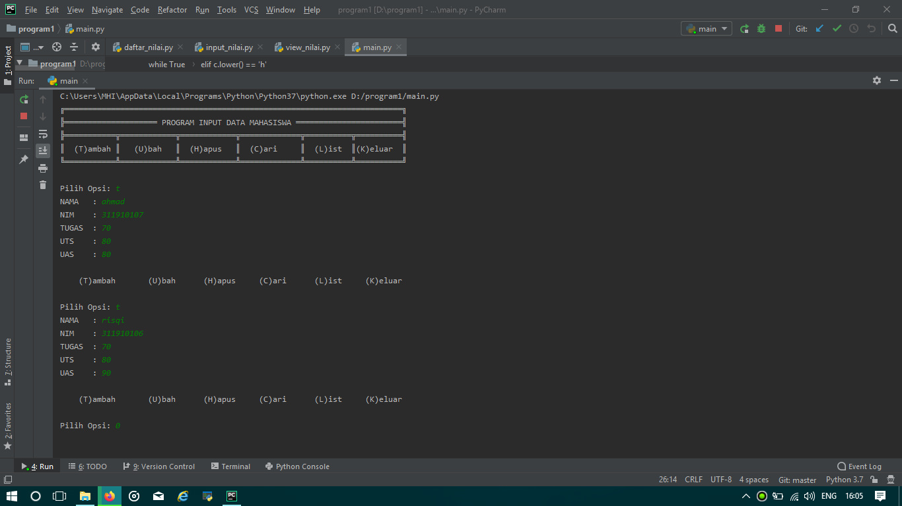
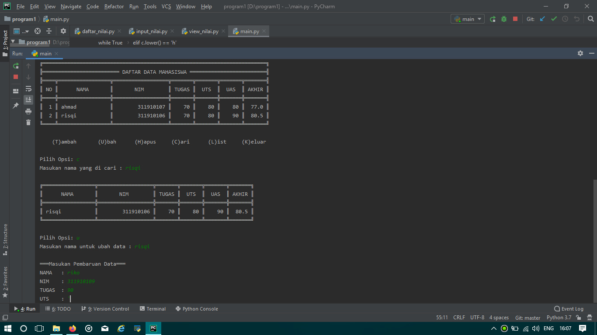
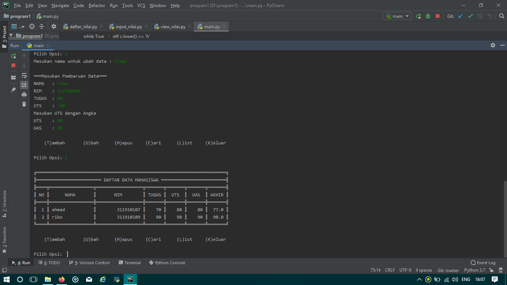
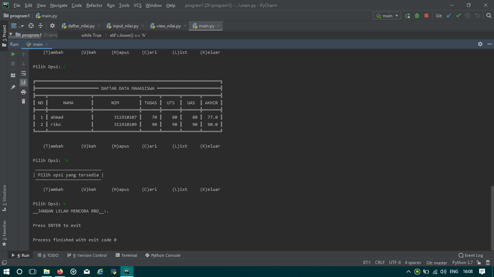

_________________PENJELASAN PERINTAH PROGRAM__________________________
- ketik "T" = "perintah untuk menambahkan data mahasiswa".
- ketik "U" = "perintah untuk ubah(edit) data mahasiswa yang sudah ada".
- ketik "L" = "perintah untuk menampilkan hasil masukan(data mahasiswa)".
- ketik "C" = "perintah untuk mencari data mahaiswa yand sudah ada".
- ketik "K" = "perintah untuk keluar dari program".
 _____________________________________________________________________

Berikut tampilan program saat di jalankan:

